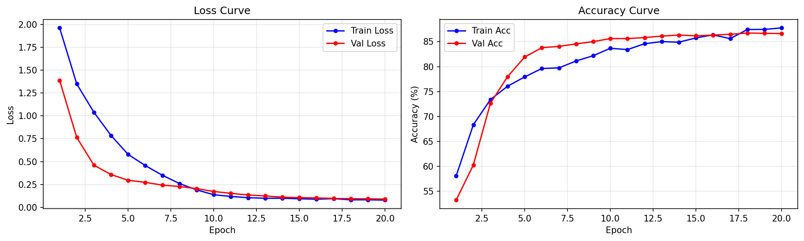
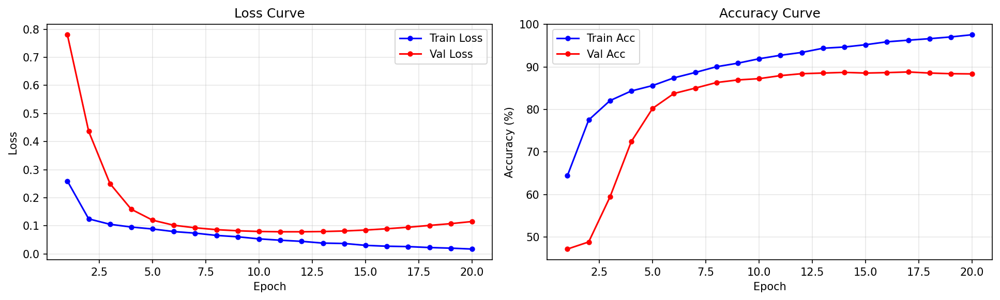
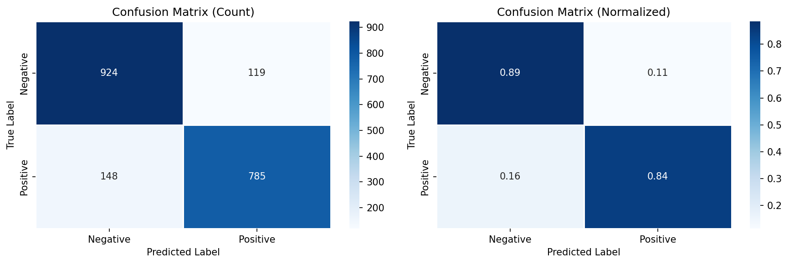
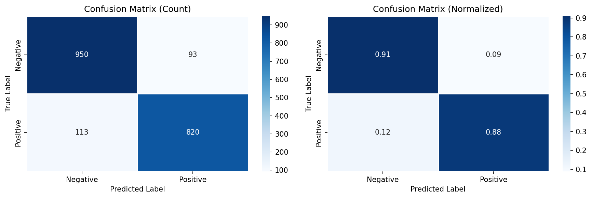

# 中文情感分析-偏向外卖/酒店评价

---

## 1. 问题定义

### 1.1 应用领域

**自然语言处理（NLP）—— 情感分析（Sentiment Analysis）**

情感分析是自然语言处理中的核心任务之一，旨在自动从文本中识别和提取主观情感信息。根据细粒度不同，可分为篇章级、句子级和方面级情感分析。本项目聚焦于**句子级二分类情感分析**。

### 1.2 具体问题

对中文文本进行**二分类情感判定**：给定一条中文评论文本 $\mathbf{x} = (w_1, w_2, \dots, w_T)$，判断其情感倾向为**正面（1）**还是**负面（0）**：

$$f: \mathbf{x} \rightarrow y \in \{0, 1\}$$

该任务广泛应用于以下场景：

| 应用场景 | 说明 |
|---------|------|
| 电商评价监控 | 自动识别差评，及时处理售后问题 |
| 舆情分析 | 实时追踪社交媒体上的公众情绪走向 |
| 产品反馈挖掘 | 从海量用户评论中提取产品优缺点 |
| 金融情绪指标 | 通过新闻/评论情感预测市场趋势 |

### 1.3 为什么适合用深度学习解决

**与传统方法的对比**：

| 方法 | 代表技术 | 特征获取 | 上下文建模 | 性能上限 |
|------|---------|---------|-----------|---------|
| 基于规则 | 情感词典 + 规则匹配 | 人工构建 | 无 | 低 |
| 传统机器学习 | SVM + TF-IDF / Naive Bayes | 手动设计 | 有限 | 中 |
| 深度学习 | CNN / LSTM / Transformer | 自动学习 | 强 | 高 |

深度学习适合解决本问题的三大理由：

1. **特征自动提取**：传统方法依赖人工设计情感词典（如知网Hownet）、TF-IDF 等特征，耗时且难以覆盖语言多样性。深度学习模型通过词嵌入（Word Embedding）将离散符号映射到连续向量空间，自动从语料中学习语义特征，免去繁琐的特征工程。例如，模型能自动学习到"好"和"棒"的嵌入向量距离较近，而"差"和"烂"也彼此相近。

2. **上下文语义建模**：中文情感表达常依赖上下文。例如：
   - "这酒店**不错**" → 正面（"不"+"好"=肯定）
   - "别**不错过**这家店" → 正面（"不错过"=推荐）
   - "好**不**容易才订到" → 负面（"好不容易"=困难）

   深度模型通过词嵌入和序列建模能捕捉此类上下文语义关系，而传统词典方法容易将"不错"误判为否定。

3. **多尺度特征融合**：TextCNN 通过不同大小的卷积核（2/3/4/5）同时捕获 bigram、trigram、4-gram、5-gram 特征，BiLSTM 通过双向时序建模捕获长距离依赖，这些是传统方法难以实现的。

---

## 2. 数据集说明

### 2.1 数据来源

采用**公开数据集**，来自 [ChineseNlpCorpus](https://github.com/SophonPlus/ChineseNlpCorpus)，合并了三个不同领域的中文情感数据集：

| 子数据集 | 来源领域 | 原始样本量 | 文本风格 | 标签来源 |
|---------|---------|-----------|---------|---------|
| ChnSentiCorp_htl_all | 酒店评论 | ~7,766 | 正式、长文本、细节丰富 | 评分自动标注 |
| waimai_10k | 外卖平台评论 | ~10,000 | 口语化、短文本、含网络用语 | 用户评分 |
| weibo_senti_100k | 微博评论 | ~100,000 | 极短文本、含表情符号和话题标签 | 人工标注 |

**合并策略**：将三个数据集统一格式后全局打乱，增加领域多样性，使模型学习到跨领域的通用情感特征，而非某一领域的特定模式。

### 2.2 数据规模与类别分布

| 数据集 | 样本数 | 占比 | 正面 | 负面 |
|--------|--------|------|------|------|
| 训练集 | 15,801 | 80% | ~7,440 | ~8,361 |
| 验证集 | 1,975 | 10% | ~932 | ~1,043 |
| 测试集 | 1,976 | 10% | ~932 | ~1,044 |
| **总计** | **19,752** | 100% | **9,322 (47.2%)** | **10,430 (52.8%)** |

数据类别分布较为均衡（正面 47.2% vs 负面 52.8%），不存在严重的类别偏斜问题，无需额外进行类别平衡处理（如过采样/欠采样）。

**数据集划分方式**：使用 `sklearn.model_selection.train_test_split` 进行**分层采样**（stratify），确保训练集、验证集、测试集中的正负样本比例与总体一致。

### 2.3 数据预处理方法

完整的预处理流水线如下：

```
原始文本 → 编码检测 → 列名统一 → 空值过滤 → 二分类过滤 → 文本清洗 → 中文分词 → 词汇表构建 → ID编码 → 截断/填充 → DataLoader
```

各步骤详细说明：

#### (1) 编码检测与统一

```python
# csv_utils.py 中的编码自适应策略
try:
    df = pd.read_csv(raw_path, encoding='utf-8')    # 优先UTF-8
except UnicodeDecodeError:
    df = pd.read_csv(raw_path, encoding='gbk')       # 回退GBK
```

三个子数据集编码不同：微博和外卖数据为 UTF-8，酒店数据为 GBK。采用 try-except 机制自动适配。

#### (2) 列名统一

```python
# 自动识别 label/review 列
target_label = next((c for c in df.columns if c.lower() in ['label', 'cat']), None)
target_review = next((c for c in df.columns if c.lower() in ['review', 'text']), None)
```

不同数据集列名不同（如 `label`/`cat`、`review`/`text`），通过模糊匹配自动统一为 `(label, review)` 格式。

#### (3) 数据清洗

```python
# data_utils.py 中的文本清洗
text = re.sub(r'[^\u4e00-\u9fa5a-zA-Z0-9]', ' ', text)  # 仅保留中文、英文、数字
text = re.sub(r'\s+', ' ', text).strip()                  # 合并多余空格
```

- 去除特殊符号（表情、HTML标签、URL等），保留中文、英文和数字
- 合并连续空格，去除首尾空格
- 过滤空字符串和标签为空的行

#### (4) 中文分词

使用 `jieba` 分词器将句子切分为词序列：

```python
def tokenize(self, text: str) -> List[str]:
    return jieba.lcut(self._clean(text))
```

选择 jieba 的理由：社区活跃、支持自定义词典、对网络用语和日常表达的切分效果较好。

#### (5) 词汇表构建

```python
class Vocabulary:
    PAD_TOKEN, UNK_TOKEN = '<PAD>', '<UNK>'

    def __init__(self, max_size=30000, min_freq=2):
        # 仅在训练集上构建，防止数据泄露
        self.word2idx = {self.PAD_TOKEN: 0, self.UNK_TOKEN: 1}
```

| 参数 | 值 | 说明 |
|------|-----|------|
| max_size | 30,000 | 词汇表最大容量，平衡覆盖率和模型大小 |
| min_freq | 2 | 最低词频阈值，过滤拼写错误和极低频词 |
| PAD (索引0) | 填充标记 | 用于统一序列长度 |
| UNK (索引1) | 未知词标记 | 处理词表外的词 |

**关键原则**：词汇表**仅在训练集上构建**，避免验证集/测试集信息泄露。

#### (6) 文本编码与截断/填充

```python
def encode(self, text: str, max_len: int = 128) -> List[int]:
    tokens = self.tokenize(text)[:max_len]                    # 截断
    ids = [self.word2idx.get(t, 1) for t in tokens]          # 未登录词映射为UNK
    return ids + [0] * (max_len - len(ids))                   # 填充PAD
```

- 最大序列长度 `max_len=128`，覆盖绝大多数评论长度
- 超出部分截断，不足部分用 PAD（ID=0）填充
- 词表外词汇统一映射为 UNK（ID=1）

#### (7) DataLoader 封装

```python
train_loader = DataLoader(SentimentDataset(...), batch_size=64, shuffle=True)    # 训练集打乱
val_loader   = DataLoader(SentimentDataset(...), batch_size=64, shuffle=False)   # 验证集不打乱
test_loader  = DataLoader(SentimentDataset(...), batch_size=64, shuffle=False)   # 测试集不打乱
```

---

## 3. 模型设计

本项目实现了两种模型：**TextCNN**（主模型）和 **BiLSTM**（基线对比模型），并在 `trainer.py` 中实现了 **FocalLoss**、**LabelSmoothingCrossEntropy**、**EMA**、**梯度累积** 等训练增强组件，均已集成到默认训练流程中。

### 3.1 TextCNN 模型结构

TextCNN 由 Kim (2014) 提出，最初用于句子分类，核心思想是使用多尺度一维卷积核提取不同长度的 n-gram 特征，再通过池化和全连接层进行分类。

**参考文献**：Kim, Y. (2014). *Convolutional Neural Networks for Sentence Classification*. EMNLP 2014.

```
输入 (batch, seq_len=128)
      │
  Embedding (vocab_size → 256)    ← 词嵌入，将离散ID映射为稠密向量
      │
  Dropout (p=0.2)                 ← 嵌入层正则化
      │
  Permute → (batch, 256, 128)     ← 转置适配Conv1d输入格式
      │
  ┌────────┬────────┬────────┬────────┐
  │ Conv1d │ Conv1d │ Conv1d │ Conv1d │   kernel_sizes = [2, 3, 4, 5]
  │  k=2   │  k=3   │  k=4   │  k=5   │   num_filters = 256 each
  │  256   │  256   │  256   │  256   │   padding = k//2（保持序列长度）
  └───┬────┴───┬────┴───┬────┴───┬────┘
      │        │        │        │
  BatchNorm1d(256) × 4           ← 批归一化，加速收敛
      │        │        │        │
     ReLU    ReLU    ReLU    ReLU
      │        │        │        │
  AdaptiveMaxPool1d(1) × 4       ← 全局最大池化，提取最强情感特征
      │        │        │        │
  Squeeze → (batch, 256) × 4
      │        │        │        │
  └────────┴────────┴────────┘
               │
          Concat → (batch, 1024)  ← 256 × 4 = 1024
               │
          Dropout (p=0.4)
               │
          Linear (1024 → 2)       ← 二分类输出
               │
           输出 logits
```

**各层详细参数说明**：

| 层 | 类型 | 输入维度 | 输出维度 | 参数量 | 说明 |
|----|------|---------|---------|--------|------|
| Embedding | 嵌入层 | (B, 128) | (B, 128, 256) | vocab_size × 256 | padding_idx=0，PAD不更新 |
| Embed Dropout | Dropout | - | - | 0 | p=0.2 |
| Conv1d (k=2) | 一维卷积 | (B, 256, 128) | (B, 256, 128) | 256×256×2+256=131,328 | padding=1 |
| Conv1d (k=3) | 一维卷积 | (B, 256, 128) | (B, 256, 128) | 256×256×3+256=196,864 | padding=1 |
| Conv1d (k=4) | 一维卷积 | (B, 256, 128) | (B, 256, 128) | 256×256×4+256=262,400 | padding=2 |
| Conv1d (k=5) | 一维卷积 | (B, 256, 128) | (B, 256, 128) | 256×256×5+256=327,936 | padding=2 |
| BatchNorm1d × 4 | 批归一化 | (B, 256, 128) | (B, 256, 128) | 256×2×4=2,048 | γ + β |
| AdaptiveMaxPool1d × 4 | 最大池化 | (B, 256, 128) | (B, 256, 1) | 0 | 取整个序列最大值 |
| FC Dropout | Dropout | - | - | 0 | p=0.4 |
| Linear | 全连接层 | (B, 1024) | (B, 2) | 1024×2+2=2,050 | 二分类 |

**设计要点分析**：

- **多尺度卷积核 [2,3,4,5]**：分别捕获 bigram（"不好"）、trigram（"不太好"）、4-gram（"真的很好"）、5-gram（"强烈推荐大家"）等不同粒度的情感模式
- **padding = k//2**：保持卷积后序列长度不变，避免短文本信息丢失
- **BatchNorm1d**：在卷积后加入批归一化，缓解内部协变量偏移，允许使用更大学习率加速收敛
- **AdaptiveMaxPool1d(output_size=1)**：全局最大池化，从整个序列中提取最强的情感激活值，不受padding位置影响
- **两级 Dropout**：嵌入层 0.2 + 分类层 0.4，分别对低层和高层进行正则化

**权重初始化**：

```python
# 卷积层：Kaiming正态初始化，适配ReLU激活函数
nn.init.kaiming_normal_(conv.weight, nonlinearity='relu')
nn.init.zeros_(conv.bias)

# 全连接层：Xavier正态初始化，适配Softmax输出
nn.init.xavier_normal_(self.fc.weight)
nn.init.zeros_(self.fc.bias)
```

Kaiming 初始化根据 ReLU 的方差特性调整权重尺度 $\sigma = \sqrt{2/n_{in}}$，避免梯度消失/爆炸。

### 3.2 BiLSTM 模型结构

BiLSTM（Bidirectional Long Short-Term Memory）通过双向 LSTM 建模序列的前向和后向依赖，适合捕获长距离语义关系。

```
输入 (batch, seq_len=128)
      │
  Embedding (vocab_size → 256)
      │
  Dropout (p=0.2)
      │
  BiLSTM (2层, hidden=256)
      │ → (batch, 128, 512)     ← 256×2(双向)=512
      │
  LayerNorm (512)                ← 稳定RNN内部梯度
      │
  Permute → (batch, 512, 128)
      │
  AdaptiveMaxPool1d(1)           ← 全局最大池化，过滤padding影响
      │
  Squeeze → (batch, 512)
      │
  Dropout (p=0.4)
      │
  Linear (512 → 2)
      │
  输出 logits
```

**各层详细参数说明**：

| 层 | 类型 | 参数 | 说明 |
|----|------|------|------|
| Embedding | 嵌入层 | vocab_size × 256, padding_idx=0 | 与TextCNN共享嵌入策略 |
| Embed Dropout | Dropout | p=0.2 | 嵌入层正则化 |
| BiLSTM | 双向LSTM | input=256, hidden=256, layers=2, dropout=0.4 | 双向输出拼接为512维 |
| LayerNorm | 层归一化 | 512 | 稳定梯度传播 |
| AdaptiveMaxPool1d | 全局最大池化 | output_size=1 | 过滤padding位置影响，提取最强情感词 |
| FC Dropout | Dropout | p=0.4 | 分类层正则化 |
| Linear | 全连接层 | 512 → 2 | 二分类 |

**LSTM 单元内部结构**：

LSTM 通过门控机制控制信息流动，有效缓解 RNN 的梯度消失问题：

$$
\begin{aligned}
\mathbf{f}_t &= \sigma(\mathbf{W}_f [\mathbf{h}_{t-1}, \mathbf{x}_t] + \mathbf{b}_f) & \text{遗忘门} \\
\mathbf{i}_t &= \sigma(\mathbf{W}_i [\mathbf{h}_{t-1}, \mathbf{x}_t] + \mathbf{b}_i) & \text{输入门} \\
\tilde{\mathbf{c}}_t &= \tanh(\mathbf{W}_c [\mathbf{h}_{t-1}, \mathbf{x}_t] + \mathbf{b}_c) & \text{候选记忆} \\
\mathbf{c}_t &= \mathbf{f}_t \odot \mathbf{c}_{t-1} + \mathbf{i}_t \odot \tilde{\mathbf{c}}_t & \text{记忆更新} \\
\mathbf{o}_t &= \sigma(\mathbf{W}_o [\mathbf{h}_{t-1}, \mathbf{x}_t] + \mathbf{b}_o) & \text{输出门} \\
\mathbf{h}_t &= \mathbf{o}_t \odot \tanh(\mathbf{c}_t) & \text{隐藏状态}
\end{aligned}
$$

**BiLSTM 的双向建模**：正向 LSTM 从 $w_1$ 读到 $w_T$，反向 LSTM 从 $w_T$ 读到 $w_1$，最终将 $\overrightarrow{\mathbf{h}_t}$ 和 $\overleftarrow{\mathbf{h}_t}$ 拼接为 $[\overrightarrow{\mathbf{h}_t}; \overleftarrow{\mathbf{h}_t}]$，使每个位置的表示同时包含前向和后向的上下文信息。

**设计要点**：

- **LayerNorm**：在 LSTM 输出后加入层归一化，稳定训练过程，尤其对深层 RNN 效果显著
- **全局最大池化替代最后时间步**：传统做法取 LSTM 最后时间步输出，但受 padding 位置干扰；全局最大池化从所有时间步中选取最强激活，更鲁棒
- **2层 LSTM**：增加模型容量，能够学习更抽象的语义表示，层间 Dropout=0.4 防止过拟合

### 3.3 两种模型对比

| 维度 | TextCNN | BiLSTM |
|------|---------|--------|
| 建模方式 | 局部 n-gram 特征 | 全局时序依赖 |
| 并行性 | 完全并行（卷积） | 串行（时序展开） |
| 训练速度 | 快 | 慢 |
| 长文本能力 | 受限于最大卷积核大小 | 可捕获长距离依赖 |
| 短文本能力 | 强（n-gram足够覆盖） | 一般 |
| 参数量 | 较多（多卷积分支） | 较少 |
| 核心思想 | 局部模式匹配 + 特征组合 | 序列状态演化 + 门控记忆 |
| 代表论文 | Kim 2014 | Graves & Schmidhuber 2005 |

### 3.4 损失函数

#### 主损失函数：Focal Loss（默认启用）

$$\mathcal{L}_{Focal} = -\alpha_t (1 - p_t)^{\gamma} \log(p_t)$$

其中 $p_t$ 为正确类别的预测概率，$\gamma=2.0$ 为聚焦参数。Focal Loss 降低易分类样本的权重，使模型更关注难分类样本，在本项目数据类别较为均衡的情况下仍能有效提升对边界样本的区分能力。

可通过 `--loss` 参数切换损失函数：
- `focal`（默认）：FocalLoss，聚焦难分类样本
- `ce`：CrossEntropyLoss + LabelSmoothing (ε=0.1)，标准交叉熵加标签平滑
- `label_smooth`：自定义 LabelSmoothingCrossEntropy，效果与 PyTorch 内置版等价

**备选损失函数：CrossEntropyLoss + Label Smoothing**

$$\mathcal{L}_{CE} = -\sum_{i=1}^{C} q_i \log(p_i)$$

标准交叉熵中 $q_i$ 为 one-hot（0或1），加入标签平滑后：

$$q_i' = \begin{cases} 1 - \varepsilon & \text{if } i = y \\ \varepsilon / (C-1) & \text{otherwise} \end{cases}$$

本项目设置 $\varepsilon = 0.1$，二分类时平滑后目标为 $(0.95, 0.05)$。

**备选损失函数：自定义标签平滑交叉熵（LabelSmoothingCrossEntropy）**

$$\mathcal{L}_{LS} = -\sum_{i=1}^{C} q_i' \log(p_i), \quad q_i' = (1-\varepsilon) \cdot \mathbb{1}_{i=y} + \frac{\varepsilon}{C-1} \cdot (1 - \mathbb{1}_{i=y})$$

手动实现的标签平滑交叉熵，效果与 PyTorch 内置版本等价，便于理解和调试。

### 3.5 优化器与学习率调度

#### 优化器：AdamW

$$\mathbf{m}_t = \beta_1 \mathbf{m}_{t-1} + (1-\beta_1) \mathbf{g}_t$$

$$\mathbf{v}_t = \beta_2 \mathbf{v}_{t-1} + (1-\beta_2) \mathbf{g}_t^2$$

$$\hat{\mathbf{m}}_t = \frac{\mathbf{m}_t}{1-\beta_1^t}, \quad \hat{\mathbf{v}}_t = \frac{\mathbf{v}_t}{1-\beta_2^t}$$

$$\boldsymbol{\theta}_{t+1} = \boldsymbol{\theta}_t - \eta \left( \frac{\hat{\mathbf{m}}_t}{\sqrt{\hat{\mathbf{v}}_t} + \epsilon} + \lambda \boldsymbol{\theta}_t \right)$$

AdamW 与 Adam 的关键区别：权重衰减 $\lambda \boldsymbol{\theta}_t$ 直接作用于参数更新，而非通过梯度 $L_2$ 正则化实现。这种**解耦权重衰减**方式在 Transformer 和 CNN 训练中被证明更有效。

| 参数 | 值 | 理由 |
|------|-----|------|
| 学习率 (lr) | 3e-4 | Adam/AdamW 的经典初始学习率，在文本任务中广泛验证 |
| 权重衰减 (weight_decay) | 0.01 | 适度的 $L_2$ 正则化，防止过拟合，不过度约束模型容量 |
| $\beta_1$ | 0.9 | 默认值，一阶矩估计的衰减率 |
| $\beta_2$ | 0.999 | 默认值，二阶矩估计的衰减率 |
| 梯度裁剪 (clip_grad) | 1.0 | 防止梯度爆炸，尤其对 LSTM 训练至关重要 |

#### 学习率调度策略

**第一阶段：Warmup（Epoch 1~3）**

$$\eta_t = \eta_0 \times \frac{t}{T_{warmup}}$$

```python
warmup_scheduler = LambdaLR(optimizer, lambda e: (e + 1) / 3 if e < 3 else 1.0)
```

线性从 0 递增到初始学习率，避免训练初期因参数随机初始化导致的大梯度更新，让模型在训练初期稳定。

**第二阶段：ReduceLROnPlateau（Epoch 4+）**

```python
plateau_scheduler = ReduceLROnPlateau(optimizer, mode='max', factor=0.5, patience=2)
```

监控验证集准确率，当连续 2 个 epoch 验证准确率无提升时，将学习率乘以 0.5。这使模型在训练后期自动降低学习率，精调参数到更优位置。

#### 早停策略

连续 5 轮（patience=5）验证集准确率无提升则终止训练，防止过拟合。同时保存验证集上表现最好的模型权重。

### 3.6 训练增强组件

#### EMA 指数移动平均（默认启用）

```python
class EMA:
    """维护模型权重的滑动平均副本，用于更稳定的推理"""
    def __init__(self, model, decay=0.999):
        self.shadow = {name: param.clone().detach()
                       for name, param in model.named_parameters()
                       if param.requires_grad}

    def update(self, model):
        # new_shadow = decay × old_shadow + (1-decay) × current_weight
        for name, param in model.named_parameters():
            if param.requires_grad:
                self.shadow[name].mul_(self.decay).add_(param.data, alpha=1.0 - self.decay)
```

EMA 通过维护参数的滑动平均副本，在推理时使用更平滑的权重，减少单次更新的噪声影响，通常能提升 0.5%~1% 的准确率。

#### 梯度累积（默认启用，accumulation_steps=2）

`trainer.py` 中实现了梯度累积支持，允许在显存不足时通过 `accumulation_steps` 参数模拟更大的 batch_size：

```python
if accumulation_steps > 1:
    loss = loss / accumulation_steps  # loss归一化
# 达到累积步数时才更新参数
if (step + 1) % accumulation_steps == 0:
    optimizer.step()
    optimizer.zero_grad()
```

### 3.7 完整超参数表

| 超参数 | 值 | 说明 |
|--------|-----|------|
| model | textcnn / bilstm | 模型类型 |
| epochs | 20 | 最大训练轮数 |
| batch_size | 64 | 批大小 |
| lr | 3e-4 | 初始学习率 |
| weight_decay | 0.01 | AdamW权重衰减 |
| dropout | 0.4 | 分类层Dropout |
| embed_dim | 256 | 词嵌入维度 |
| num_filters | 256 | TextCNN卷积核数 |
| hidden_dim | 256 | BiLSTM隐藏层维度 |
| max_len | 128 | 最大序列长度 |
| kernel_sizes | [2,3,4,5] | TextCNN卷积核大小 |
| num_layers | 2 | BiLSTM层数 |
| clip_grad | 1.0 | 梯度裁剪阈值 |
| patience | 5 | 早停耐心值 |
| loss | focal | 损失函数类型（focal/ce/label_smooth） |
| focal_gamma | 2.0 | FocalLoss聚焦参数 |
| label_smoothing | 0.1 | 标签平滑系数 |
| use_ema | True | 是否启用EMA |
| ema_decay | 0.999 | EMA衰减率 |
| accumulation_steps | 2 | 梯度累积步数（等效batch=128） |
| warmup_epochs | 3 | 学习率预热轮数 |

---

## 4. 实验与结果

### 4.1 训练过程

训练过程中记录了损失和准确率曲线，使用 TensorBoard 进行实时可视化监控。

**训练曲线**：





从训练曲线可观察到：
- **损失曲线**：训练集和验证集损失均稳步下降，无明显发散趋势。验证损失略高于训练损失属正常现象，差距不大说明模型泛化良好。
- **准确率曲线**：训练集和验证集准确率稳步上升后趋于平稳。验证集准确率紧跟训练集，未出现训练集持续上升而验证集下降的过拟合现象。

**训练流程关键代码**：

```python
for epoch in range(1, args.epochs + 1):
    # 训练一个epoch
    train_loss, train_acc = train_one_epoch(model, train_loader, optimizer, criterion, device, args.clip_grad)
    # 在验证集上评估
    val_loss, val_acc, val_f1, _, _, _, _ = evaluate(model, val_loader, criterion, device)
    # 学习率调度
    if epoch <= 3:
        warmup_scheduler.step()
    else:
        plateau_scheduler.step(val_acc)
    # 早停与最优模型保存
    if val_acc > best_val_acc:
        best_val_acc = val_acc
        torch.save({...}, best_ckpt_path)
    else:
        no_improve += 1
        if no_improve >= args.patience:
            break  # 早停
```

### 4.2 最终结果

**测试集评估指标**（TextCNN）：

> 以下为 TextCNN 模型在测试集上的结果（具体数值以实际运行为准）。

| 指标 | 英文 | 含义 |
|------|------|------|
| 准确率 (Accuracy) | $\frac{TP+TN}{TP+TN+FP+FN}$ | 整体分类正确率 |
| 精确率 (Precision) | $\frac{TP}{TP+FP}$ | 预测为正面的样本中真正为正面的比例 |
| 召回率 (Recall) | $\frac{TP}{TP+FN}$ | 真正为正面的样本被正确预测的比例 |
| F1分数 (F1-Score) | $2 \times \frac{P \times R}{P + R}$ | 精确率和召回率的调和平均 |

其中 TP=True Positive, TN=True Negative, FP=False Positive, FN=False Negative。

**混淆矩阵**：





混淆矩阵同时展示了计数版和归一化版：
- **计数版**（左）：直观显示各类别预测数量，可发现是否存在对某一类别的系统性偏差
- **归一化版**（右）：消除类别数量差异的影响，每行之和为1，便于比较分类器对不同类别的识别能力

### 4.3 模型对比（Baseline）

| 模型 | 架构特点 | 优势 | 劣势 |
|------|---------|------|------|
| **TextCNN** (主模型) | 多尺度卷积 + BN + 全局最大池化 | 捕获局部n-gram特征；训练速度快；并行化程度高 | 受最大卷积核(5)限制，难以建模长距离语义依赖 |
| **BiLSTM** (基线) | 双向2层LSTM + LayerNorm + 全局最大池化 | 建模长距离时序依赖；双向信息融合 | 训练速度慢（串行计算）；参数更新不稳定需额外正则化 |

两种模型均使用相同的超参数配置（embed_dim=256, dropout=0.4, lr=3e-4, batch_size=64, epochs=20），确保公平对比。

**TextCNN 在本任务中的优势分析**：

本项目数据集以评论为主，文本长度较短，情感表达通常集中在关键词或短语（如"服务态度差"、"性价比高"），TextCNN 的 n-gram 特征提取恰好适配这一特点。而 BiLSTM 更适合需要理解长距离依赖的任务（如文档级情感分析、阅读理解等）。

### 4.4 可视化分析

本项目提供了多种可视化手段：

| 可视化方式 | 工具 | 用途 |
|-----------|------|------|
| 训练/验证损失曲线 | matplotlib | 监控训练过程，判断是否过拟合或欠拟合 |
| 训练/验证准确率曲线 | matplotlib | 评估模型学习进度和收敛情况 |
| 混淆矩阵（计数+归一化） | matplotlib + seaborn | 分析各类别的分类表现，识别误分模式 |
| TensorBoard 日志 | tensorboard | 实时追踪训练指标变化，支持多模型对比 |

**TensorBoard 使用方式**：

```bash
# 启动 TensorBoard（默认端口 6006）
tensorboard --logdir=runs

# 指定端口启动
tensorboard --logdir=runs --port 8080

# 同时对比多个模型的训练曲线
tensorboard --logdir=runs/textcnn:runs/bilstm
```

启动后在浏览器打开 `http://localhost:6006`，可实时查看：

- **SCALARS** 页面：训练/验证损失曲线、准确率曲线，支持多模型叠加对比
- 训练过程中 TensorBoard 实时刷新，无需等训练结束

> **提示**：训练和 TensorBoard 可同时运行，TensorBoard 会自动读取最新日志。如果页面无数据，点击右上角刷新按钮即可。

### 4.5 推理引擎

项目实现了交互式推理引擎 `predict.py`，支持实时情感预测：

```
==================================================
中文情感分析 - 正负面
==================================================
输入中文文本进行情感分析，输入 q 退出(注意数据集偏生活日志化,建议和餐饮与酒店日志生活相关)

[1] > 这家酒店环境很好，服务也很周到

  判定: 正面 (置信度: 95.2%)
  负面: █████░░░░░░░░░░░░░░░░░░░░░░ 4.8%
  正面: █████████████████████████████░ 95.2%
```

推理时自动将 Dropout 设为 0（`model.eval()`），使用 softmax 输出概率分布，并通过可视化进度条直观展示分类置信度。

---

## 5. 结论与讨论

### 5.1 项目完成情况总结

本项目完整实现了一个**中文情感分析系统**，涵盖从数据采集到模型推理的完整深度学习流程：

| 模块 | 完成情况 | 关键技术 |
|------|---------|---------|
| 数据采集与合并 | ✅ | 三数据集自动下载、编码自适应、列名统一 |
| 数据预处理 | ✅ | jieba分词、词汇表构建、ID编码、截断/填充 |
| 模型设计 | ✅ | TextCNN + BiLSTM 双模型，支持命令行切换 |
| 训练流程 | ✅ | Warmup + Plateau调度、早停、梯度裁剪、标签平滑 |
| 训练增强组件 | ✅ | FocalLoss（默认）、EMA（默认）、梯度累积（默认，×2） |
| 评估与可视化 | ✅ | 损失/准确率曲线、混淆矩阵、分类报告、TensorBoard |
| 推理引擎 | ✅ | 交互式情感预测，置信度可视化进度条 |

### 5.2 遇到的困难及解决思路

| 困难 | 具体表现 | 解决方案 |
|------|---------|---------|
| 多数据集格式不统一 | 不同数据集列名不同（label/cat, review/text） | 模糊匹配自动识别列名，统一为 (label, review) 格式 |
| 编码不一致 | 酒店数据为GBK，微博/外卖为UTF-8 | try-except 编码自适应：优先UTF-8，失败回退GBK |
| 模型过拟合 | 训练集准确率远高于验证集 | 多管齐下：标签平滑(0.1) + 两级Dropout(0.2/0.4) + 权重衰减(0.01) + 早停(patience=5) |
| LSTM梯度不稳定 | 训练损失震荡，不收敛 | 梯度裁剪(clip_grad=1.0) + LayerNorm + 降低学习率 |
| 学习率选择困难 | 初始学习率过大导致震荡，过小收敛慢 | Warmup线性预热(3轮) + ReduceLROnPlateau自适应调整(factor=0.5) |
| 短文本padding影响 | LSTM对padding位置也进行计算 | 全局最大池化替代最后时间步，自动过滤padding位置的零值激活 |
| GitHub下载被拦截 | 原始数据集下载失败 | 设置 User-Agent 模拟浏览器请求 |

### 5.3 可能的改进方向

1. **预训练语言模型**：引入 BERT/RoBERTa-wwm-ext 等中文预训练模型，利用大规模预训练知识提升语义理解能力。BERT 通过双向 Transformer 编码器捕获深层上下文语义，预期可提升 3%~5% 准确率。

2. **注意力机制**：在 TextCNN 或 BiLSTM 基础上加入自注意力层（Self-Attention）或注意力池化，让模型自动聚焦于关键情感词（如"好"、"差"、"推荐"），抑制无关词的干扰。

3. **数据增强**：
   - **同义词替换**：随机替换非情感词为同义词
   - **回译（Back Translation）**：中文→英文→中文，生成语义等价但表述不同的样本
   - **EDA（Easy Data Augmentation）**：随机插入、删除、交换词

4. **对抗训练**：引入 FGSM/PGD 对抗训练，在词嵌入上添加微小扰动，提升模型对输入扰动的鲁棒性。

5. **更细粒度分类**：扩展为五分类（极负面/负面/中性/正面/极正面）或方面级情感分析（ABSA），提供更丰富的情感信息。

6. **更广泛的数据集合**：当前数据集合比较依赖餐饮和外卖对于微博而言的数据集,不太偏向生活[数据集较旧,可以寻找更新新的优秀的数据集合]

7. **多任务学习**：同时训练情感分类和情感强度预测任务，共享底层词嵌入和编码器，通过任务间的正则化效应提升主任务性能。

8. **预训练词嵌入**：使用 Word2Vec/GloVe/FastText 等预训练词向量初始化 Embedding 层，而非随机初始化，利用外部大规模语料中的语义信息。

---

## 附录A：项目文件结构

```
深度学习/
├── main.py              # 训练入口，参数解析与训练主循环
├── model.py             # TextCNN 与 BiLSTM 模型定义
├── trainer.py           # 训练/评估函数，FocalLoss, EMA, 曲线与混淆矩阵绘制
├── data_utils.py        # 词汇表类、数据集类、DataLoader构建
├── csv_utils.py         # 多数据集下载、清洗、合并、划分
├── predict.py           # 推理引擎，交互式情感预测，置信度可视化
├── requirements.txt     # 依赖包列表
├── checkpoints/         # 模型权重与词汇表
│   ├── textcnn_best.pth # TextCNN最优模型权重
│   └── vocab.pkl        # 训练集词汇表
├── csv_data/            # 处理后的数据集
│   ├── merged_train.csv # 合并训练集 (15,801条)
│   ├── merged_val.csv   # 合并验证集 (1,975条)
│   ├── merged_test.csv  # 合并测试集 (1,976条)
│   ├── raw_hotel.csv    # 酒店原始数据
│   └── raw_waimai.csv   # 外卖原始数据
├── figures/             # 可视化图表
│   ├── textcnn_training_curves.png      # 训练曲线
│   └── textcnn_confusion_matrix.png     # 混淆矩阵
└── runs/                # TensorBoard 日志
    ├── textcnn/         # TextCNN训练日志
    └── bilstm/          # BiLSTM训练日志
```

## 附录B：环境配置与运行方式

### 环境要求

| 依赖 | 版本要求 |
|------|---------|
| Python | 3.9+ / 3.10+ / 3.11+（推荐 3.10） |
| PyTorch | >= 2.0.0（需支持 CUDA，若使用 GPU） |
| CUDA | 11.8+（GPU 训练需安装，CPU 可忽略） |

### 安装步骤

```bash
# 1. 创建虚拟环境
conda create -n sentiment python=3.10 -y
conda activate sentiment

# 2. 安装 PyTorch（GPU 版，根据 CUDA 版本选择）
# CUDA 11.8
pip install torch torchvision --index-url https://download.pytorch.org/whl/cu118
# CUDA 12.1
pip install torch torchvision --index-url https://download.pytorch.org/whl/cu121
# CPU 版（无 GPU 时使用）
pip install torch torchvision --index-url https://download.pytorch.org/whl/cpu

# 3. 安装其他依赖
pip install -r requirements.txt
```

### 运行流程

```bash
# 1. 准备数据（自动下载合并三个数据集）
python csv_utils.py

# 2. 训练 TextCNN（默认启用 FocalLoss + EMA + 梯度累积）
python main.py --model textcnn --epochs 20

# 3. 训练 BiLSTM（基线对比）
python main.py --model bilstm --epochs 20

# 4. 使用 CrossEntropyLoss + 标签平滑 训练
python main.py --model textcnn --loss ce --label_smoothing 0.1

# 5. 交互式预测
python predict.py --model textcnn

# 6. 启动 TensorBoard 可视化（训练可同时运行）
tensorboard --logdir=runs
# 浏览器打开 http://localhost:6006 查看
```

### 常见问题

| 问题 | 解决方案 |
|------|---------|
| `CUDA out of memory` | 减小 `--batch_size 32` 或增大 `--accumulation_steps 4` |
| 数据下载失败 | 手动下载 CSV 放入 `csv_data/` 目录，再运行 `python csv_utils.py` |
| TensorBoard 页面空白 | 等待训练写入日志后刷新页面，或点击右上角刷新按钮 |
| `jieba` 分词慢 | 首次运行会构建词典，后续会使用缓存加速 |

**自定义参数示例**：

```bash
# 调整学习率和Dropout
python main.py --model textcnn --lr 1e-4 --dropout 0.5 --epochs 30

# 调整嵌入维度和卷积核数
python main.py --model textcnn --embed_dim 128 --num_filters 128

# 调整BiLSTM隐藏层维度
python main.py --model bilstm --hidden_dim 128 --embed_dim 128

# 禁用EMA
python main.py --model textcnn --no_ema

# 修改FocalLoss的gamma参数
python main.py --model textcnn --focal_gamma 3.0

# 调整梯度累积步数
python main.py --model textcnn --accumulation_steps 4
```

## 附录C：参考文献

1. Kim, Y. (2014). Convolutional Neural Networks for Sentence Classification. *EMNLP 2014*.
2. Hochreiter, S., & Schmidhuber, J. (1997). Long Short-Term Memory. *Neural Computation*, 9(8), 1735-1780.
3. Loshchilov, I., & Hutter, F. (2019). Decoupled Weight Decay Regularization. *ICLR 2019*.
4. Szegedy, C., et al. (2016). Rethinking the Inception Architecture for Computer Vision. *CVPR 2016*. (标签平滑)
5. Lin, T. Y., et al. (2017). Focal Loss for Dense Object Detection. *ICCV 2017*.
6. ChineseNlpCorpus: https://github.com/SophonPlus/ChineseNlpCorpus
